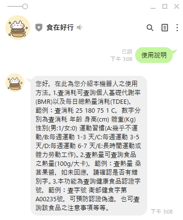

# 食在好行 line機器人

- 查詢食品熱量
- 每日總熱量消耗 (TDEE)
- 基礎代謝率 (BMR)
- 健康食品字號查詢

幫助你養成良好習慣!

## 導覽
- [加為好友](#Friend)
- [使用說明](#Instruction)
- [API資訊](#API)

## 加為好友
- line ID: `@007advwb`
- 掃描 QRcode 

## 使用說明

- 點選選單查看使用說明

- 輸入身體資料、運動習慣查詢BMR、TDEE

- 輸入食品名稱查詢食品熱量

- 輸入字號查詢健康食品資料

## API資訊
- 此機器人使用 [食品營養成分 API](https://data.gov.tw/dataset/8543) 與 [健康食品 API](https://data.gov.tw/dataset/6951) 與 [基礎代謝率 (BMR) 計算機](https://tools.heho.com.tw/bmr/)